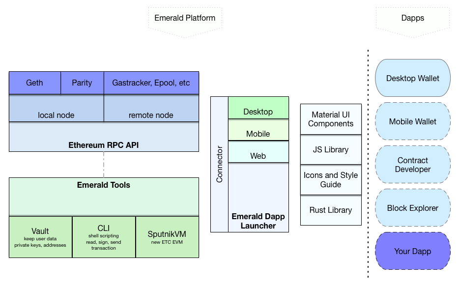

# Emerald Platform

## Overview

### Ethereum RPC API

Decentralized applications utilize an Ethereum node to connect with the Ethereum blockchain.  Using the Ethereum RPC API, users can run a local node or remote node for their application.

### Emerald Tools

A decentralized application may contain functionality to sign transactions, access accounts via private key, or store smart contracts. Emerald Vault and Emerald CLI are offline applications that provide account management; storing private keys, signing transactions, storing smart contracts, etc... 

### Connector

Decentralized applications can be launched on number of devices, and users can utilize a variety tools to connect their dApp with a front-end interface. Users can use libraries, ui components, other means to create a Dapp interface.

### Dapps

Upon putting all these components together, a user creates their own decentralized applications. Users can create block explorers, wallets, and other applications that use the Ethereum blockchain. 


Emerald Platform is compatible is compatible with Ethereum and Ethereum Classic.  


