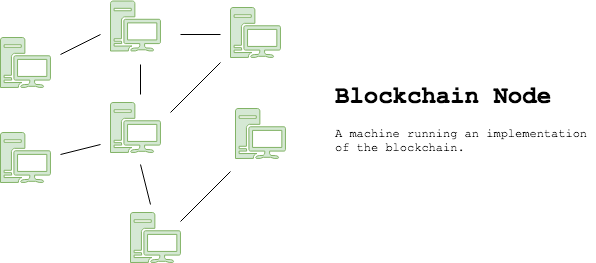

# ETC Nodes

## Overview



A blockchain node is **a machine running an implementation of the blockchain**. Running an Ethereum Classic node allows a user to be part of the Ethereum Classic network enabling a user or AI to:

* Create and sign transactions
* Manage accounts
* Read information from the network
* Mine ETC
* and more...

Running an Ethereum Classic node downloads and syncs the entire blockchain to a machine. This implementation is known as a **Full Node** or **Local Node**. Since running a full node can be process intensive for some machines, users may utilize a third party implementation known as a **Light Node** or **Remote Node**.


Interactions performed on the blockchain are done through a node. Many app wallet users don't realize that their wallets submit transactions through a third party node being the wallet app provider or other party.


### Why Run Your Own Node

1. **Control YOUR transactions:** Utilizing your own node to perform activity on the Ethereum Classic network ensures you are in control of your activity. Using a third party node can be ideal for some users, but trust third parties at your own risk.
2. **Take Part in the ETC Network:** More independent nodes ensures the security and resilience of the network, as well as increased performance such as, reduced latency.
3. **Developers! Developers! Developers!:** Developers can use nodes to deploy and interact with Smart Contracts for their DApps.

## How to Setup an ETC Classic Node

**Go Ethereum**, commonly known as **Geth** or ****_**Classic**_ **Geth**, is the command line interface for running an Ethereum Classic node.


Ethereum ETH and Ethereum Classic ETC both have a Geth implementation. _Classic_ Geth simply emphasizes that we're using Ethereum Classic's Geth implementation.


### Dependencies



#### Dependencies

Install [Homebrew](https://brew.sh/) package manager.

```text
$ /usr/bin/ruby -e "$(curl -fsSL https://raw.githubusercontent.com/Homebrew/install/master/install)"
```

Check installation of Homebrew.

```text
$ brew -v
```

Install Go programming language by downloading a binary distribution at the [Go Lang.](https://golang.org/) website.

Check installation of Go Lang.

```text
$ go version
```

Install a C compilar \(X Code\).

```text
$ xcode-select --install
```



### Install _Classic_ Geth



**Installing Classic Geth**

Install _Classic_ Geth using Homebrew package manager.

```text
$ brew install ethereumproject/classic/geth
```

Check installation of _Classic_ Geth

```text
$ geth version
```

Update Geth \(if applicable\) 

The Ethereum Classic protocol is always being improved and maintained by the love of the Ethereum Classic developer community. Sometimes bugs are discovered, improvements are made, features are added, etc... To upgrade geth to the latest version simply run:

```text
$ brew upgrade geth
```



### Initialize 


