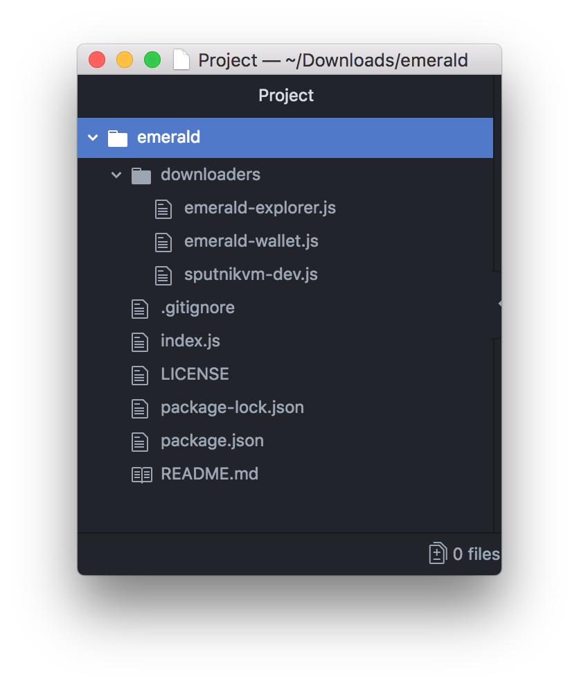

# Emerald Starter Kit

## Initialize

Emerald SDK utilizes Truffle's smart contract management to compile, deploy, and test smart contracts. However, you don't need to install Truffle!

Make a directory for your DApp. Name the directory `emerald-starter-kit`.

```text
$ mkdir emerald-starter-kit
```

Inside the DApp directory, create a new Emerald DApp with `emerald new`

```text
$ cd emerald-starter-kit
$ emerald new
New Emerald project created 
```

## Internals 

What is included in the starter-kit.



 The starter kit is a barebones react app. However, Emerald is attentive to specific directories and files that one may notice is Truffle based DApps. 

* `contracts/` : directory is for **Solidity** contracts.
  * `Migrations.sol` : is automatically generated by and often does not need to be touched.
  * `Todos.sol` : is the custom smart contract for the DApp. 
* `migrations/` : directory for scriptable deployment files
  * `text/` : directory for  testing the DApp and contracts
* `truffle.js` : blockchain client configuration file.


`truffle.js is where the Ethereum Classic client in configured.`


### **Truffle.js**



```javascript
module.exports = {
    networks: {
      development: {
        host: 'localhost',
        port: *,
        gas: *,
        network_id: '*' // Match any network id
      }
    }
  };
```



```javascript
// Common Emerald Wallet "geth" config.
module.exports = {
    networks: {
      development: {
        host: 'localhost',
        port: 8545,
        gas: 6000000,
        network_id: '*' // Match any network id
      }
    }
  };
```



```javascript
// Common Ganache Ethereum client config.
module.exports = {
    networks: {
      development: {
        host: 'localhost',
        port: 7545,
        gas: 6000000,
        network_id: 5777
      }
    }
  };
```



  


